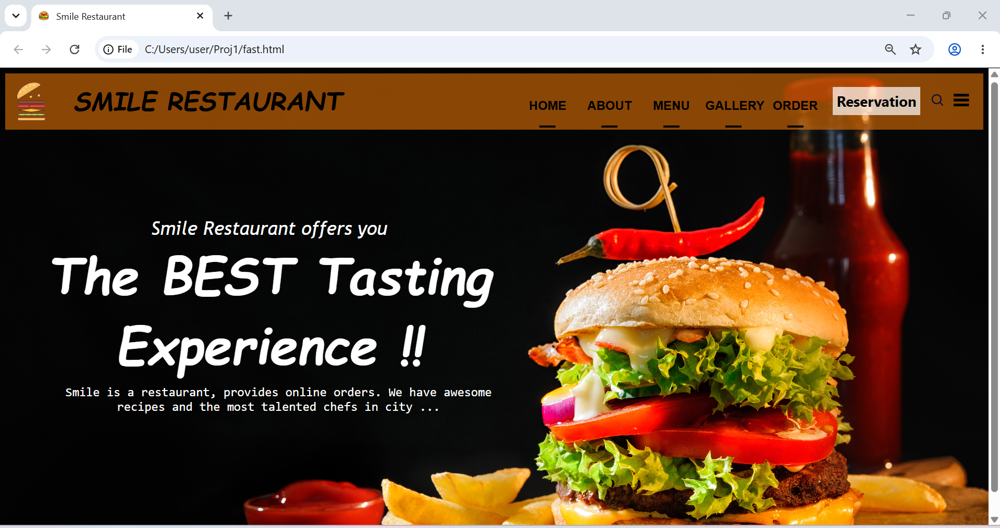

<h1>Restaurant Landing Page</h1>

A simple restaurant landing page built with HTML and CSS as my first web development project. It’s a small project, but I built it completely without AI and learned a lot through practice, especially creating the header, working with spacing, and structuring the page layout.

<h2>Technologies Used</h2>

<ul>
  <li>HTML</li>
  <li>CSS</li>
</ul>

<h2>Features</h2>

<ul>
  <li>Restaurant focused landing page</li>
  <li>Navigation between page sections</li>
  <li>Styled content, images, buttons, and links</li>
</ul>

<h2>What I Learned</h2>

  This project helped me practice the basics of HTML and CSS, including
  webpage structure, styling, layouts, images, links, and organizing a
  simple front-end project.

<h2>Development Process</h2>

I started by creating the page structure with HTML, then added the layout and visual styling with CSS. I practiced organizing the project files and used Live Server to run and preview the website directly in the browser while making changes.

<h2>Possible Improvements</h2>

  The project could later be improved with JavaScript interactions,
  better responsiveness, animations, and additional functionality.

<h2>How to Run</h2>

<ol>
  <li>Clone the repository.</li>
  <li>Open the project folder.</li>
  <li>Open <code>fast.html</code> in a web browser.</li>
</ol>

<h2>Project Status</h2>

  A beginner web development project created to practice HTML and CSS
  fundamentals.

<h2>Media</h2>

<h3>Screenshot</h3>

<h3>Project Demo</h3>

  <a href="video_of_project.mp4">
    View the project demo video
  </a>

